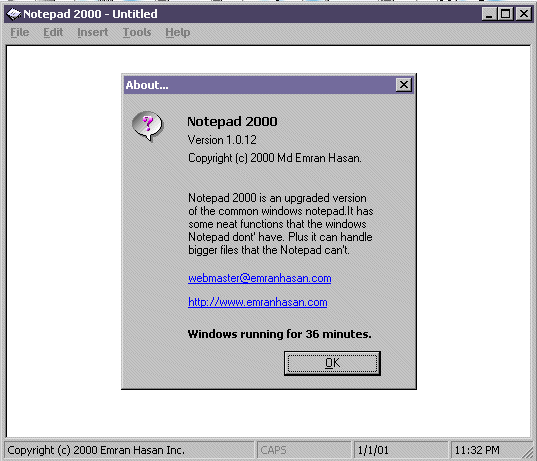



## Notepad 2000

### Description

Notepad 2000 is a text editor that is much stronger than the windows notepad. But it has some KOOL features that the normal Notepad don't have. The extended features are : 1.Find/Replace 2.Select All 3.Autotext 4.Symbol 5.Date/Time (with various format) 6.Full Screen Mode 7.Encryption/Decryption 8.Options 9. Document Statistics etc.
 
### More Info
 
:-)

8-)

;-)

:-(

             |
---                |---
**Submitted On**   |2001-01-01 07:00:36
**By**             |[Md Emran Hasan](https://github.com/Planet-Source-Code/PSCIndex/blob/master/ByAuthor/md-emran-hasan.md)
**Level**          |Intermediate
**User Rating**    |4.3 (13 globes from 3 users)
**Compatibility**  |VB 4\.0 \(16\-bit\), VB 4\.0 \(32\-bit\), VB 5\.0, VB 6\.0
**Category**       |[Encryption](https://github.com/Planet-Source-Code/PSCIndex/blob/master/ByCategory/encryption__1-48.md)
**World**          |[Visual Basic](https://github.com/Planet-Source-Code/PSCIndex/blob/master/ByWorld/visual-basic.md)
**Archive File**   |[CODE\_UPLOAD13226112001\.zip](https://github.com/Planet-Source-Code/md-emran-hasan-notepad-2000__1-13996/archive/master.zip)

